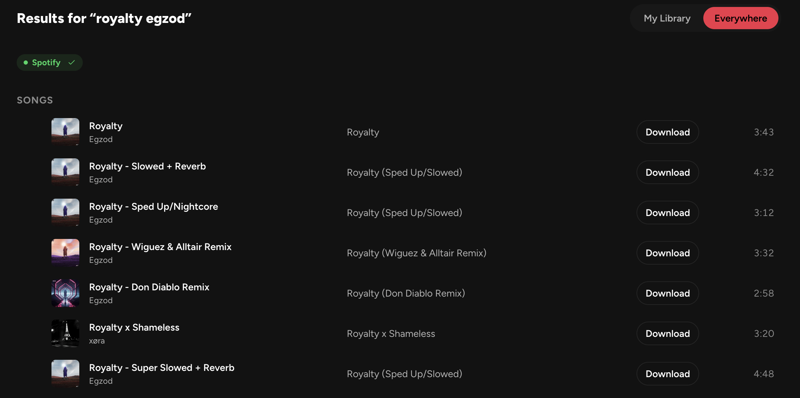
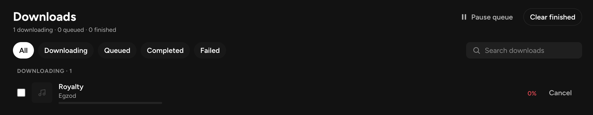
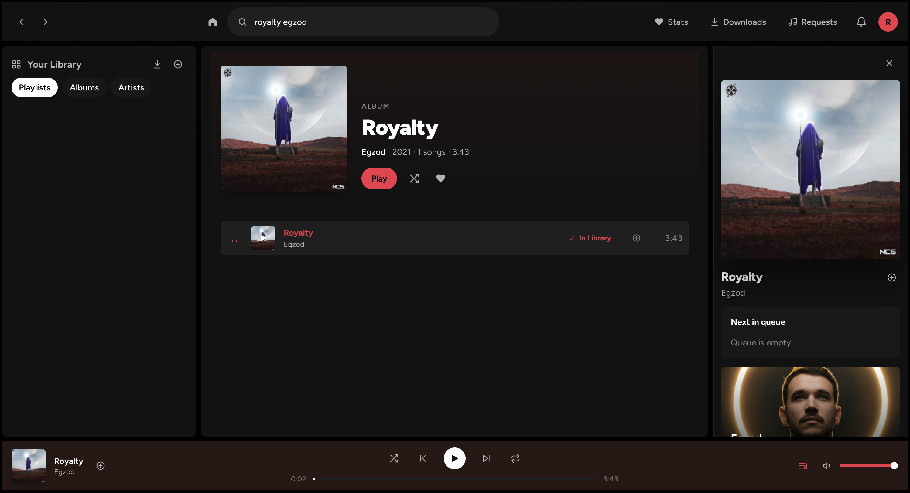

<p align="center">
  
</p>

<h1 align="center">Reverb</h1>
<p align="center">
  Self-hosted music, done right. Search, download, play. All in app.<br/>
</p>

<p align="center">
  
  
  
  
</p>

**Reverb** is a self-hosted music app that unifies your existing music library, the
broader catalog you can search online, and one-click downloading — in a single
fast web UI. It is a Go single-binary modular monolith with an embedded
React/TypeScript SPA.

> Reverb is for personal use with music you have the legal right to download. See
> [Legal & ethical use](#legal--ethical-use).

## Screenshots


_Search Everywhere — one box spans your library and online sources, with live
per-source streaming and library matching._


_A one-click spotDL download in progress, with live WebSocket progress._


_The web player — queue, shuffle, repeat, seek, and keyboard shortcuts._

## The core loop

1. **Search everywhere** — one search box spans your library and online sources
   (e.g. keyless Deezer or configured Spotify) at once, streaming results as each source responds.
2. **See what you already have** — results are matched against your library
   (by ISRC/metadata), so you instantly know what is missing.
3. **One-click download** — missing tracks download via spotDL into your music
   folder; live progress streams over a WebSocket.
4. **It just appears** — when the download finishes, Reverb rescans your library
   and the track flips to in-library — ready to play, in the same row.

## Features

- Unified library browsing (artists / albums / playlists) backed by a
  Subsonic/Navidrome server.
- Gapless-feeling web player with queue, shuffle, repeat, seek, and keyboard
  shortcuts.
- "Search Everywhere" with live per-source streaming (SSE) and library matching
  — Deezer works keyless out of the box; add Spotify credentials for its catalog.
- One-click spotDL downloads with live progress and auto play-when-ready.
- Pluggable adapters (library / search / downloader) configured in-app, with a
  first-run setup wizard.
- Single static binary, SPA embedded; ships as one Docker image (Python3 +
  ffmpeg + pinned spotDL included).
- Responsive UI (desktop + mobile), installable as a PWA with OS media-key /
  lock-screen playback controls.

## Quick start (Docker Compose)

No clone or build needed — Compose pulls the published image:

```bash
mkdir reverb && cd reverb
curl -O https://raw.githubusercontent.com/maxjb-xyz/reverb/main/docker-compose.yml
mkdir music
docker compose up -d
```

Open http://localhost:8090 and finish the first-run wizard. Reverb uses the
`./music` folder for downloads, keeps its database in a managed Docker volume, and
bundles both the music server and downloader — no extra containers or configuration
are needed.

To use an existing music folder, pin a version, or configure Spotify, download
[.env.example](.env.example) as `.env` and uncomment the settings you need. Add
the keyless **Deezer** search adapter in Settings after setup. Full deployment,
backup, and reverse-proxy guidance is in [docs/deployment.md](docs/deployment.md).

## Library backends

By default Reverb runs a **bundled music server** (Navidrome) inside the same
container — just mount your music at `/music` and start it. Nothing else to set up.

Prefer your own server? In **Settings → Library backend**, switch to **External
Subsonic** and add your Navidrome/Subsonic server under **Admin**. In external
mode nothing extra runs inside the Reverb container.

## Configuration reference

Reverb is configured by flags, environment variables, and the in-app Settings UI.
**Precedence: flags > environment > defaults.**

### Flags

| Flag | Default | Description |
| --- | --- | --- |
| `--port` | `8090` | HTTP listen port |
| `--db` | `./data/reverb.db` | SQLite database path |
| `--dev` | `false` | Dev mode (proxies the Vite dev server) |

### Environment variables

| Variable | Description |
| --- | --- |
| `REVERB_PORT` | HTTP listen port (same as `--port`); defaults to `8090` |
| `REVERB_DB` | SQLite path (same as `--db`); the Docker image defaults this to `/data/reverb.db` |
| `REVERB_DEV=1` | Enable dev mode |
| `REVERB_DOWNLOAD_DIR` | Directory spotDL downloads into **and** the folder the bundled Navidrome serves. The Docker image defaults this to `/music` |
| `REVERB_ADMIN_PASSWORD` | Seed the admin password on first run only (ignored once setup is complete). **Unset it after first boot.** |
| `REVERB_SPOTIFY_CLIENT_ID` | Spotify app Client ID (alternative to setting it in the Settings UI) |
| `REVERB_SPOTIFY_CLIENT_SECRET` | Spotify search adapter Client Secret (overrides stored config) |
| `REVERB_LIBRARY_PASSWORD` | Subsonic/Navidrome library adapter password (overrides stored config) |
| `REVERB_SPOTDL_PATH` | Path to the spotDL binary. Defaults to the bundled one; rarely needed |
| `REVERB_NAVIDROME_BIN` | Path to the Navidrome binary for bundled library mode. Defaults to the bundled one; rarely needed |

Secrets (`REVERB_*_SECRET`, `REVERB_*_PASSWORD`, `REVERB_ADMIN_PASSWORD`) should be
provided via environment / `.env` only — never committed. `.env` is gitignored;
`.env.example` is the committed template. `REVERB_ADMIN_PASSWORD` is read **only on
first run** to seed the admin account; once setup is complete it is ignored, so
unset it after the first boot rather than leaving a plaintext password in your
environment.

### Exposing Reverb to the internet

Reverb serves plain HTTP and relies on a same-origin session cookie. Before you
expose it beyond a trusted LAN, put it behind a **TLS-terminating reverse proxy**
(Caddy, nginx, Traefik, …). The proxy MUST set/overwrite the `X-Forwarded-Proto`
header so Reverb can tell that the original request was HTTPS. See
[docs/deployment.md](docs/deployment.md#reverse-proxy--tls) for ready-to-use
Caddy and nginx configs.

## Legal & ethical use

Reverb is a tool for **personal use with content you have the legal right to
access and download**. By using Reverb you agree that:

- You are responsible for complying with the laws of your jurisdiction and the
  **terms of service** of every service you connect Reverb to (your music server,
  Spotify, etc.). Reverb does not grant any rights to content.
- **spotDL is a separate, third-party tool** that Reverb invokes. Reverb does not
  host, distribute, or provide any copyrighted content; it orchestrates tools you
  configure. How you use spotDL is your responsibility.
- Reverb is intended for downloading music **you own or are otherwise legally
  entitled to** (e.g. content you have purchased or that is freely licensed). Do
  not use Reverb to infringe copyright.
- Reverb is provided **"as is", without warranty of any kind**. The authors are
  not liable for misuse. See the [LICENSE](LICENSE).

## Architecture overview

Reverb is a **modular monolith**: a single Go binary organized around clean
**adapter seams** — `library` (Subsonic/Navidrome), `search` (Deezer / Spotify), and
`downloader` (spotDL) — each registered explicitly at the composition root (no
`init()` side-effects). The frontend is a React/TypeScript SPA embedded into the
binary at build time (`-tags prod`). State and events flow through an in-process
EventBus that backs both the WebSocket and the download manager. The full design
rationale follows those explicit adapter boundaries and the package-level tests.
The HTTP API is documented in OpenAPI, served live at `/api/v1/openapi.yaml`.

## Development & contributing

See [CONTRIBUTING.md](CONTRIBUTING.md)

## License

**AGPL-3.0-only** — chosen because Reverb is a network-served, self-hosted app
that bundles GPL-family tooling (spotDL); AGPL keeps modifications open for a
networked service and matches the self-hosted-media-server tradition. See
[LICENSE](LICENSE).
